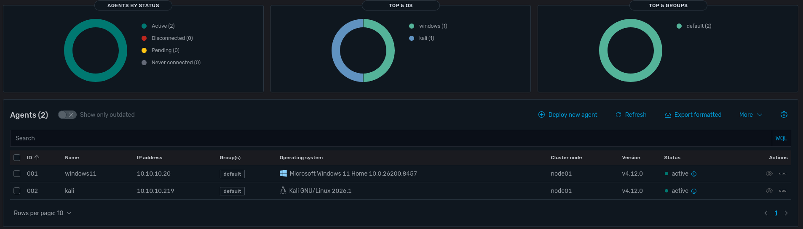
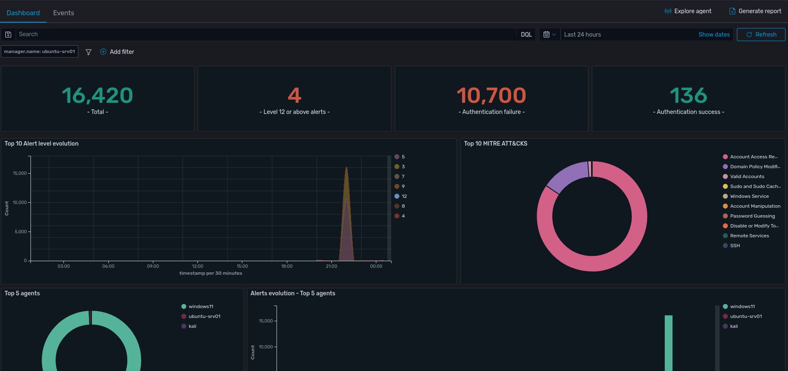
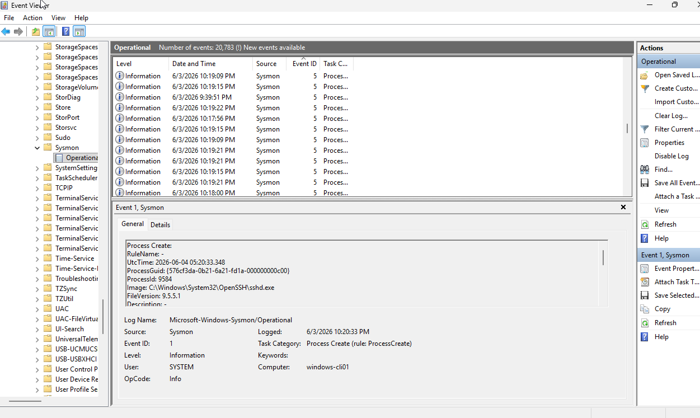
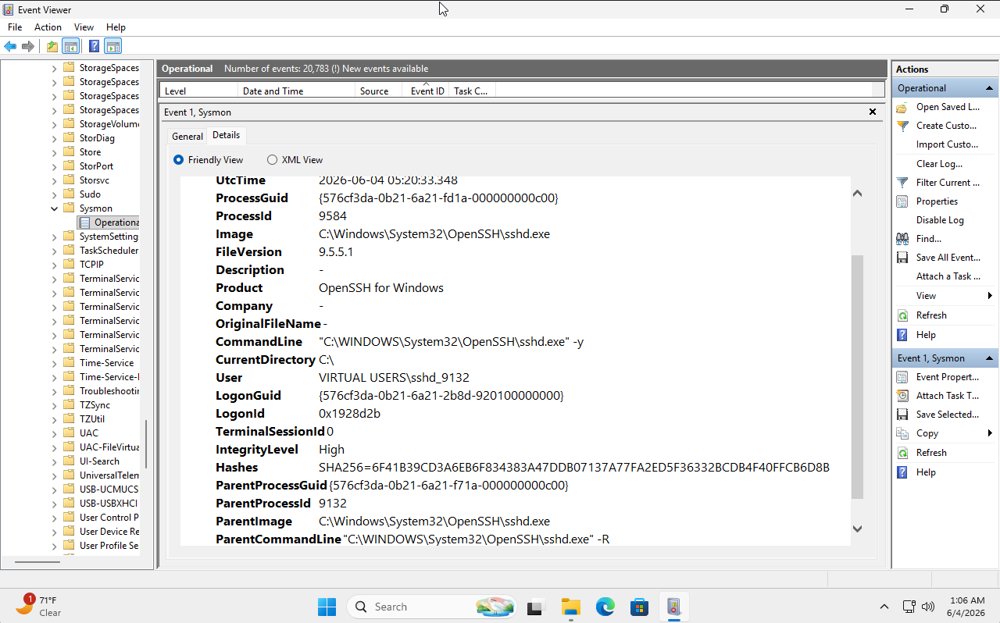

# 🔍 Wazuh SIEM — Detection & Monitoring Lab

A working **Wazuh SIEM** deployment built inside my isolated [cybersecurity homelab ("Namek")](https://github.com/pervis007/cybersecurity-homelab). An **Ubuntu Server (Goku)** runs the full Wazuh stack as the central manager, with agents deployed to a **Kali Linux** attacker box and a **Windows 11** target — giving me end-to-end visibility to detect and investigate attacks as they happen.

> Built and maintained by **Pervis Harden** — Cybersecurity Analyst · Ethical Hacker · Orlando, FL
> 🔗 Portfolio: [pervis007.github.io](https://pervis007.github.io) · ✉️ p.harden32@gmail.com

---

## 🖥️ The Server (Goku — Ubuntu Server)

The Ubuntu Server host (**Goku**) is the brain of the SIEM. It runs the complete Wazuh **all-in-one** stack — the **manager** (analysis + rule engine), the **indexer** (data storage/search), and the **dashboard** (web UI). Agents on the other machines report into it, and all detection, correlation, and alerting happens here.

Confirming the install on the server:

```console
goku@ubuntu-srv01:~$ sudo /var/ossec/bin/wazuh-control info
WAZUH_VERSION="v4.12.0"
WAZUH_REVISION="rc1"
WAZUH_TYPE="server"
```

```console
goku@ubuntu-srv01:~$ sudo systemctl status wazuh-manager wazuh-indexer wazuh-dashboard
● wazuh-manager.service    - Wazuh manager     │ active (running)
● wazuh-indexer.service    - Wazuh indexer     │ active (running)
● wazuh-dashboard.service  - Wazuh dashboard   │ active (running)
```

- **`WAZUH_TYPE="server"`** confirms this node is the manager (not an agent).
- The dashboard is served over HTTPS at `https://<goku-ip>` and is the single pane of glass for the whole lab.

---

## 🛰️ Architecture

```
                         ┌──────────────────────────────┐
                         │      GOKU — Ubuntu Server     │
                         │   Wazuh Manager + Indexer +   │
                         │          Dashboard            │
                         │        (SIEM server)          │
                         └───────────────▲──────────────┘
                      agent telemetry     │     (port 1514/1515)
                  ┌──────────────────────┴───────────────────────┐
                  │                                               │
        ┌─────────┴──────────┐                       ┌────────────┴─────────┐
        │  FRIEZA — Kali     │                       │  VEGETA — Windows 11 │
        │  Wazuh Agent       │                       │  Wazuh Agent         │
        │  10.10.10.219      │                       │  10.10.10.20         │
        └────────────────────┘                       └──────────────────────┘
```

| Host | Role | Wazuh role | OS |
|---|---|---|---|
| **Goku** | Server / Services | **Manager + Indexer + Dashboard** | Ubuntu Server |
| **Frieza** | Attacker / Pentester | Agent (`kali`) | Kali GNU/Linux 2026.1 |
| **Vegeta** | Target / User | Agent (`windows11`) | Windows 11 Home |

> Manager and agents all run **Wazuh v4.12.0**, communicating over the isolated `Namek` network (`10.10.10.0/24`).

---

## 📦 Agent Deployment

A Wazuh **agent** is a lightweight service installed on each monitored endpoint. It collects logs, file-integrity data, and security events and ships them to the manager on **Goku**. Two agents were enrolled — one Linux, one Windows.

### 🔴 Kali Linux (Frieza) — Linux agent

On Debian-based systems like Kali, the agent installs from the Wazuh APT repository. The `WAZUH_MANAGER` variable points the agent at Goku's IP so it knows where to register:

```console
root@frieza:~# WAZUH_MANAGER="<goku-ip>" WAZUH_AGENT_NAME="kali" \
    apt install wazuh-agent

root@frieza:~# systemctl daemon-reload
root@frieza:~# systemctl enable --now wazuh-agent
root@frieza:~# systemctl status wazuh-agent
● wazuh-agent.service - Wazuh agent
     Active: active (running)
```

The agent registers with the manager automatically and appears in the dashboard within seconds.

### 🟡 Windows 11 (Vegeta) — Windows agent

On Windows the agent ships as an MSI. It's installed silently from an elevated PowerShell prompt, again pointing at Goku as the manager, then the service is started:

```powershell
PS C:\> .\wazuh-agent-4.12.0.msi /q `
    WAZUH_MANAGER="<goku-ip>" `
    WAZUH_AGENT_NAME="windows11"

PS C:\> NET START WazuhSvc
The Wazuh Svc service was started successfully.
```

Once the service starts, the Windows host enrolls and begins forwarding event logs (logons, process creation, etc.) to the SIEM.

---

## ✅ Enrolled Agents

Both agents show **active** in the Wazuh dashboard, reporting from the `Namek` network:



| ID | Name | IP address | Operating system | Version | Status |
|---|---|---|---|---|---|
| 001 | `windows11` | `10.10.10.20` | Microsoft Windows 11 Home (10.0.26200) | v4.12.0 | 🟢 active |
| 002 | `kali` | `10.10.10.219` | Kali GNU/Linux 2026.1 | v4.12.0 | 🟢 active |

- **Agents by status:** 2 active, 0 disconnected, 0 pending
- **Top OS:** windows (1), kali (1) · **Group:** default (2) · **Cluster node:** node01

---

## 🎯 Why This Matters

With agents reporting from both the **attacker** and the **target**, this SIEM closes the purple-team loop: I can launch an attack from Frieza (Kali) against Vegeta (Windows 11) and watch the telemetry land on Goku's dashboard — failed logons, suspicious processes, and MITRE ATT&CK-mapped alerts — then investigate and tune detections.

## 💥 Attack Simulation: SSH Brute Force (Hydra)

To prove the SIEM actually catches an attack, I ran a controlled **SSH brute-force** from the Kali host (Frieza, 10.10.10.219) against a **single target — the Windows 11 machine at 10.10.10.20** (running OpenSSH for Windows). This was a direct host-to-host attack, not a network-wide sweep. I used **Hydra** and the **rockyou.txt** wordlist against the `root` account:

```bash
$ hydra -l root -P /usr/share/wordlists/rockyou.txt ssh://10.10.10.20
```

Wazuh detected it immediately — a sharp spike of authentication failures with critical correlated alerts and MITRE ATT&CK context:



| Metric | Value |
|---|---|
| Total alerts | 16,420 |
| **Authentication failures** | **~10,700** |
| Authentication successes | 136 |
| **Critical (level 12+) alerts** | **4** |
| MITRE ATT&CK | Brute Force (T1110), Password Guessing (T1110.001), Valid Accounts (T1078) |

### 📄 Full Vulnerability Assessment Report

I wrote up the whole exercise as a formal report — attack execution, evidence, vulnerability finding (CVSS), MITRE mapping, **root-cause analysis**, and **step-by-step remediation** — with the auto-generated Wazuh Threat Hunting report appended as an appendix:

**➡️ [SSH-BruteForce-Vulnerability-Assessment.pdf](reports/SSH-BruteForce-Vulnerability-Assessment.pdf)**

**Headline finding:** `CRITICAL` — SSH permits password authentication for `root` with no rate-limiting, lockout, or MFA, allowing unlimited automated password guessing. Remediation: disable root login, enforce key-based auth, deploy Fail2Ban + MFA, and tune Wazuh active-response to auto-ban attacking IPs.

## 🧬 Endpoint Telemetry: Sysmon on Windows

To go beyond default Windows logging, I deployed **Sysmon** (System Monitor) on the Windows host (`windows-cli01`). Sysmon records rich endpoint detail — **process creation with command lines, parent process lineage, and binary SHA-256 hashes** — and feeds it straight into Wazuh, which is exactly the telemetry needed to investigate the brute-force activity at the process level.

### Installation (PowerShell, elevated)

```powershell
# 1. Download Sysmon (Sysinternals) and a detection-focused config
Invoke-WebRequest -Uri "https://download.sysinternals.com/files/Sysmon.zip" -OutFile "$env:TEMP\Sysmon.zip"
Expand-Archive "$env:TEMP\Sysmon.zip" -DestinationPath "C:\Sysmon" -Force
Invoke-WebRequest -Uri "https://raw.githubusercontent.com/SwiftOnSecurity/sysmon-config/master/sysmonconfig-export.xml" -OutFile "C:\Sysmon\sysmonconfig.xml"

# 2. Install Sysmon as a service with the config
C:\Sysmon\Sysmon64.exe -accepteula -i C:\Sysmon\sysmonconfig.xml

# 3. Verify the service is running
Get-Service Sysmon64
Get-WinEvent -LogName "Microsoft-Windows-Sysmon/Operational" -MaxEvents 1
```

> In the isolated `Namek` network (no internet egress), the Sysmon binary and config were staged locally rather than pulled live.

### Forward Sysmon events to Wazuh

The Wazuh agent is told to collect the Sysmon channel by adding this to `C:\Program Files (x86)\ossec-agent\ossec.conf`, then restarting the agent:

```xml
<localfile>
  <location>Microsoft-Windows-Sysmon/Operational</location>
  <log_format>eventchannel</log_format>
</localfile>
```

```powershell
Restart-Service WazuhSvc
```

### Evidence

Sysmon's Operational log filled with events (20,783+) and captured the OpenSSH server activity tied to the attack:





### 🔗 Correlation with the SSH Brute-Force Report

This closes the loop on the [SSH brute-force assessment](reports/SSH-BruteForce-Vulnerability-Assessment.pdf). The target host **runs OpenSSH for Windows**, so the Hydra attack against `ssh://10.10.10.20` is visible from two angles at once:

| Evidence source | What it shows |
|---|---|
| **Wazuh auth alerts** | ~10,700 authentication failures (Windows logon-failure rule 60122) during the attack window |
| **Sysmon Event ID 1** | Repeated **Process Create** events for `C:\Windows\System32\OpenSSH\sshd.exe` (`OpenSSH for Windows` 9.5.5.1) as the daemon forked to service each incoming Hydra connection |
| **Process integrity** | SHA-256 `6F41B39C…CB6D8B`, parent `sshd.exe -R`, user `VIRTUAL USERS\sshd_*`, integrity level High |

The flood of short-lived `sshd.exe` child processes is the host-side fingerprint of the same brute-force that produced the authentication-failure spike — authentication telemetry (what failed) now corroborated by process telemetry (what ran). With binary hashes captured, every executed process can also be checked against an allowlist or threat intel.

## 🔒 System Hardening

Beyond remediating the specific SSH finding, these baseline controls reduce the overall attack surface across the lab. They apply to both the Linux and Windows hosts and are detailed further in the [Vulnerability Assessment report](reports/SSH-BruteForce-Vulnerability-Assessment.pdf) (Section 9).

| Area | Key steps |
|---|---|
| **Patch management** | Keep all hosts current; enable automatic security updates (`unattended-upgrades` / Windows Update) |
| **Accounts & privilege** | Strong password policy + lockout, least privilege, remove unused/admin accounts, restrict `sudo`, **MFA** for remote/privileged access |
| **Service & network** | Disable unused services, close unused ports, **default-deny host firewall** (`ufw` / Windows Defender Firewall), network segmentation |
| **Remote access** | SSH keys (no root login), RDP with NLA restricted to VPN/management subnets |
| **Application control** | Deny-by-default **allowlisting** (AppLocker / WDAC / Zero Trust), approving software by hash — pairs with the SHA-256s Sysmon captures |
| **Logging & monitoring** | `auditd` + Sysmon forwarded to Wazuh, **File Integrity Monitoring (FIM)** on critical paths |
| **Benchmarking** | **Wazuh Security Configuration Assessment (SCA)** against **CIS Benchmarks** to score hosts and track hardening drift |

```bash
# Examples
sudo apt update && sudo apt upgrade -y                     # patch
sudo systemctl disable --now <unused-service>              # minimize services
sudo ufw default deny incoming && sudo ufw allow 22/tcp && sudo ufw enable   # default-deny firewall
```

> 💡 Wazuh's built-in **SCA module** runs CIS Benchmark checks out of the box — a fast way to measure how hardened each agent is and prioritize fixes.

---

*Part of my [cybersecurity homelab](https://github.com/pervis007/cybersecurity-homelab) and [portfolio](https://pervis007.github.io).*
